# MVP Sample for Springboot

Springboot로 작성한 backend microservice 예제입니다.   
mysql과 연동하여 data를 CRUD하며, swagger page로 API를 테스트 할 수 있습니다.   


## 사전준비 
- [STS](https://spring.io/tools)를 설치합니다.
- [DBeaver](https://dbeaver.io/)를 설치합니다.  
- NFS Dynamic provisiong을 사용하려면, [NFS설치와 Dynamic provisiong설정](https://happycloud-lee.tistory.com/178?category=832243)을 참조하십시오.
- [run-cicd 파이프라인](https://happycloud-lee.tistory.com/195?category=832250) 다운로드
```
$ cd ~
$ git clone https://github.com/happyspringcloud/run-cicd.git
```

## mysql 설치
- DB설치 
아래 참조하여 설치   
[centos8에 mysql 설치하고 DB생성 및 연결](https://happycloud-lee.tistory.com/229?category=832250)    


## Database, Table 생성 
- DBeaver를 실행합니다. 
- 새로운 Connection을 만듭니다. 


Server Host는 mysql이 설치된 VM의 public IP를 지정합니다.  
Database는 mysql, user는 root, 암호는 mysql설치 시 지정한 암호를 입력합니다. 


- Database 'msadb'를 생성합니다. 
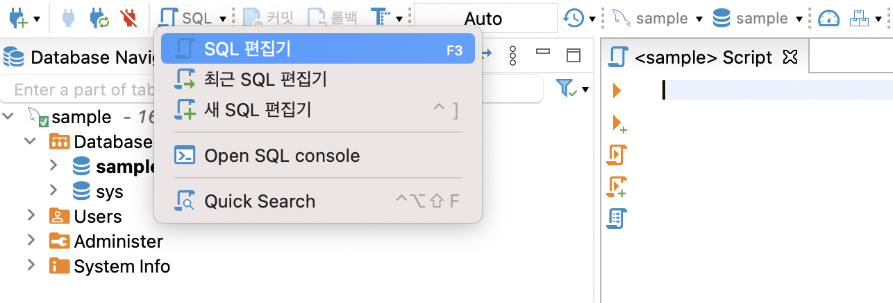
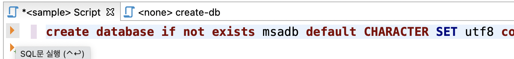

아래 내용을 붙여넣기 하고, 위 그림과 같이 왼쪽 화살표 아이콘을 클릭하여 실행합니다.   
```
create database if not exists msadb default CHARACTER SET utf8 collate utf8_unicode_ci;
```

새로고침하여, msadb가 생성되었는지 확인합니다.   
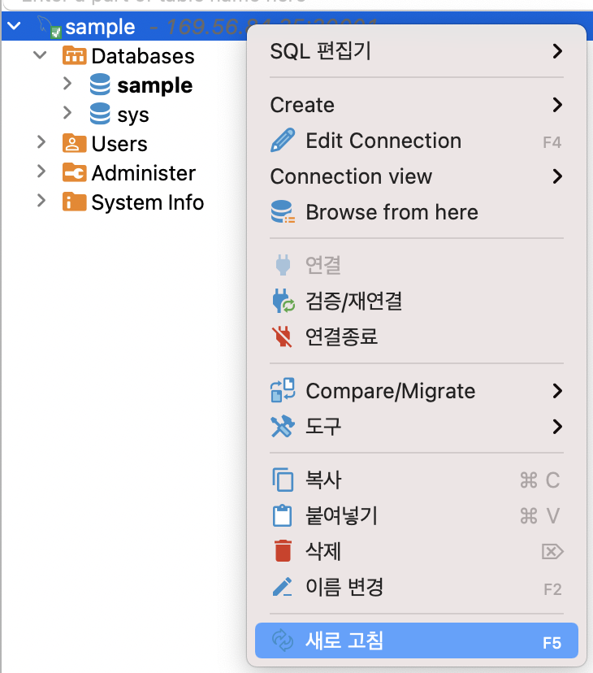

- user 'msa'를 만듭니다.  
아래 내용을 붙여넣기 하고, 왼쪽 화살표 아이콘을 클릭하여 실행합니다.   
```
create user 'msa'@'%' IDENTIFIED by 'passw0rd';
```

- user 'msa'가 msadb를 사용할 수 있도록 권한을 부여합니다.   
아래 내용을 붙여넣기 하고, 왼쪽 화살표 아이콘을 클릭하여 실행합니다.   
```
grant all PRIVILEGES on msadb.* to 'msa'@'%';
```


- Connection을 편집하여, Database를 msadb로 변경합니다. 
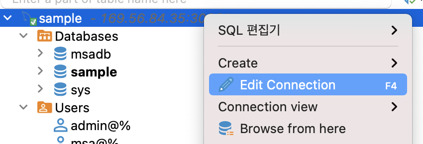

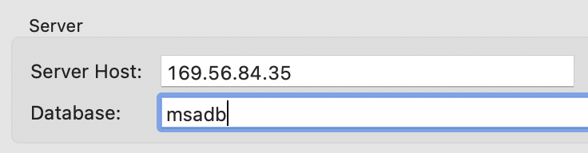

- Table 'tb_user'를 생성합니다. 
SQL편집기를 열고, 아래 내용을 실행합니다. 
```
CREATE TABLE `tb_user` (
  `id` int(11) unsigned NOT NULL AUTO_INCREMENT,
  `user_id` varchar(50) DEFAULT NULL,
  `user_nm` varchar(250) DEFAULT NULL,
  `addr` varchar(500) DEFAULT NULL,
  `cell_phone` varchar(250) DEFAULT NULL,
  `agree_info` varchar(50) DEFAULT NULL,
  `birth_dt` varchar(50) DEFAULT NULL,
  PRIMARY KEY (`id`)
) ENGINE=InnoDB AUTO_INCREMENT=4 DEFAULT CHARSET=UTF8;
```

## 프로그램 다운로드, 테스트
- PC에서 이 repository를 본인 git으로 fectch합니다. 
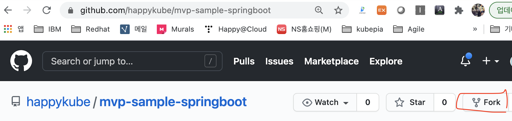

- PC에서 fetch한 repository를 clone합니다. 
```
> git clone https://github.com/{your git org}/mvp-sample-springboot.git
```

- STS에 import합니다. 
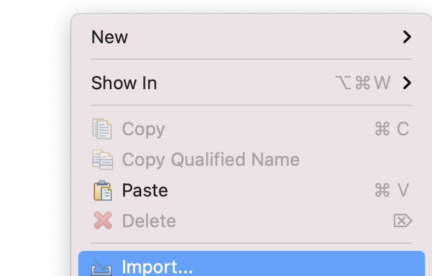
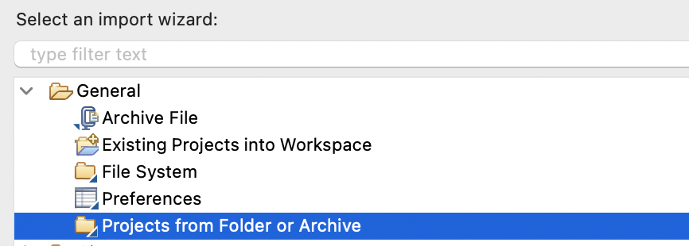

clone한 디렉토리를 선택합니다. 프로젝트를 선택하고, [Finish]를 클릭합니다.   
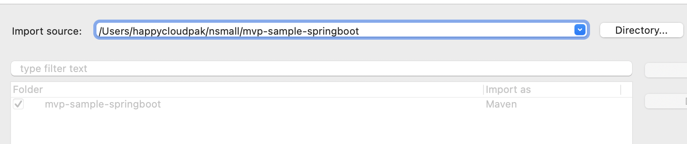


- Update project를 수행합니다.  
Project를 선택하고, 우측마우스를 누른 후 'Maven > Update project'를 실행합니다.    
아래 그림과 같이 'Force ...'를 체크하고 업데이트를 수행합니다.   
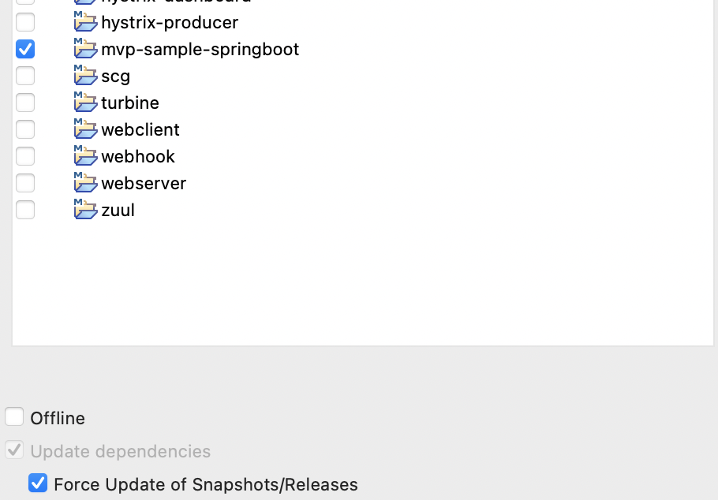


- application.yaml파일을 열어, mysql host의 IP를 수정합니다.  
k8s node중 아무거나 한 Node의 IP를 지정하면 됩니다.   
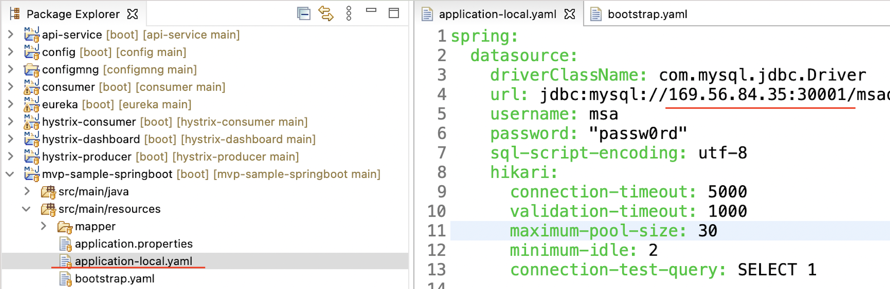

- mvp-sample-springboot를 실행합니다.  
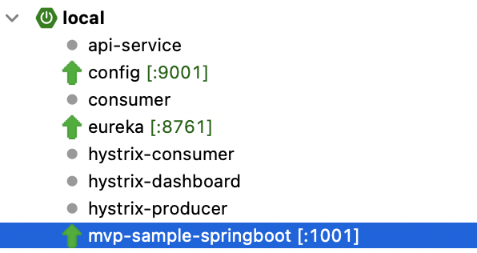

- 웹브라우저에서 http://localhost:1001/swagger-ui/를 오픈합니다.  
API가 정상적으로 수행되는지 확인한다.   

## config 수정   
- cicd/cicd-common.properties 수정 
  - container image 정보: image_registry, image_project, image_tag
  - namespace  
  - service_host
- cicd/cm-dev.env, cicd/cm-prod.env에서 db_host 변경 

## k8s에 배포
- PC의 소스를 git repository로 push합니다.
```
$ git add . --all && git commit -m "initial push" && git push -u origin main 
```

- k8s에 연결된 PC 또는 VM에 접속합니다.  

- 본인의 OS user로 전환합니다.  

- 작업 디레토리를 만들고, 이동합니다.  
```
$ mkdir -p ~/work 
$ cd ~/work
```

- 소스를 clone합니다. 
```
$ git clone https://github.com/{your git org}/mvp-sample-springboot.git
```

- run-cicd로 빌드 & 배포합니다.  
```
$ run-cicd
[hklee@bastion mvp-sample-springboot]$ run-cicd
# container image registry 로그인 username: happycloudpak
# container image registry 로그인 password: xxxxxxxxx
# kubernetes context name(현재 context는 .): .
# 배포대상 프로파일(dev/prod): dev
# base directory(현재 directory는 .): .
# 개발언어(java/nodejs/react): java
# config server ingress name(해당없으면 ENTER): 
```

- Pod가 Running상태가 될때까지 기다립니다. 
```
[hklee@bastion mvp-sample-springboot]$ kubectl get po -w | grep mvp-sample-springboot
mvp-sample-springboot-0                           1/1     Running     0          25m
```

- ingress주소를 복사하여, 웹브라우저에서 오픈합니다.  
```
[hklee@bastion mvp-sample-springboot]$ kubectl get ing | grep mvp-sample-springboot
mvp-sample-springboot   <none>   hklee.mvp-sample-springboot.169.56.84.37.nip.io
```
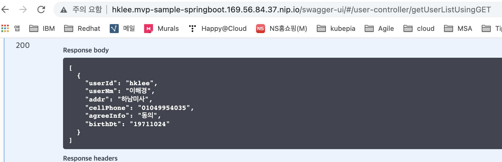


