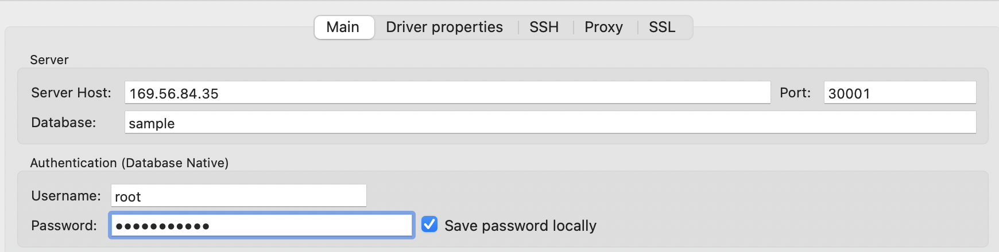
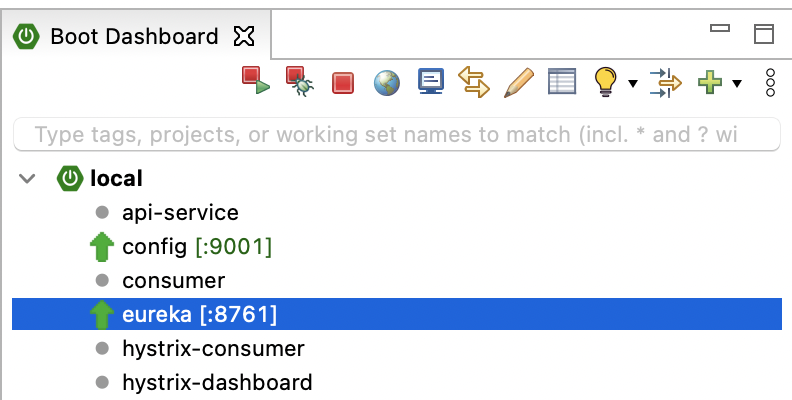

# MVP Sample for Springboot

Springboot로 작성한 backend microservice 예제입니다.   
mysql과 연동하여 data를 CRUD하며, swagger page로 API를 테스트 할 수 있습니다.   

## 사전준비 
- [STS](https://spring.io/tools)를 설치합니다.
- [DBeaver](https://dbeaver.io/)를 설치합니다.  
- NFS Dynamic provisiong을 사용하려면, [NFS설치와 Dynamic provisiong설정](https://happycloud-lee.tistory.com/178?category=832243)을 참조하십시오.
- [run-cicd 파이프라인](https://happycloud-lee.tistory.com/195?category=832250) 다운로드
```
$ cd ~
$ git clone https://github.com/happyspringcloud/run-cicd.git
```
- [config server](https://happycloud-lee.tistory.com/209?category=902419) 개발 및 배포 
sample은 https://github.com/happykube/config 참조   

- [eureka server](https://happycloud-lee.tistory.com/210?category=902419) 개발 및 배포 
sample은 https://github.com/happykube/eureka 참조   


## mysql 설치
- k8s에 인증된 PC 또는 VM으로 접속합니다. 작업 OS id로 바꿉니다.   
```
$ su - {userid}
``` 

- 작업 디렉토리를 작성하고 이동합니다. 
```
$ mkdir -p ~/install/mysql
$ cd ~/install/mysql
``` 

- helm chart registry를 추가합니다. 
helm은 yum과 같은 프로그램 설치관리자이며 k8s에 리소스(pod, service 등)를 쉽게 배포해 줍니다.  
helm chart은 k8s 리소스 정의 파일들을 묶어 놓은것입니다.  
bitnami는 helm chart를 제공하는 회사명이며, 안정적인 helm chart를 제공하는 고마운 회사입니다.   
```
$ helm repo add bitnami https://charts.bitnami.com/bitnami
$ helm repo ls
$ helm repo update
```

- mysql chart의 위치를 찾습니다. 
아래 예에서는 bitnami/mysql	입니다.   
```
[hklee@bastion mysql]$ helm search repo mysql
NAME                   	CHART VERSION	APP VERSION	DESCRIPTION
bitnami/mysql          	8.5.1        	8.0.23     	Chart to create a Highly available MySQL cluster
bitnami/phpmyadmin     	8.2.4        	5.1.0      	phpMyAdmin is an mysql administration frontend
```
- mysql chart의 configuration 파일을 다운로드 합니다.  

```
$ helm inspect values bitnami/mysql > mysql.yaml

```

- 아래 예제를 참조하여 mysql.yaml을 수정합니다.  
쉽게 하려면, mysql.yaml을 다운로드하지 말고, 아래 내용으로 그냥 만드세요.   

storageClassName은 k get sc로 확인하시고, nodePort는 충돌안나게 지정하세요.  

```
## MySQL architecture. Allowed values: standalone or replication
architecture: replication

auth:
  rootPassword: "happy@cloud"
  database: sample
  username: "admin"
  password: "happy@cloud"
  ##
  replicationUser: replicator
  replicationPassword: "happy@cloud"

primary:
  persistence:
    enabled: true
    storageClass: "nfs-standard"
    accessModes:
      - ReadWriteOnce
    size: 8Gi

  service:
    type: NodePort
    port: 3306
    nodePort: 30001

secondary:
  replicaCount: 2
  persistence:
    enabled: true
    storageClass: "nfs-standard"
    accessModes:
      - ReadWriteOnce
    size: 8Gi
  service:
    type: NodePort
    port: 3306
    nodePort: 30002
```

- mysql을 배포합니다.   
```
$ kubens {본인 namespace} 
$ helm install mysql -f mysql.yaml bitnami/mysql --dry-run

위 명령 실행결과에 에러가 없으면 아래 명령으로 설치합니다.   
$ helm install mysql -f mysql.yaml bitnami/mysql
```

- 정상 동작 확인   
아래 명령으로 mysql-primary, mysql-secondary Pod들이 모두 Running 상태가 될때까지 기다립니다.    
모니터링을 중단하려면 CTRL-C를 누릅니다.    
```
$ kubectl get po -w 
```

# Database, Table 생성 
- DBeaver를 실행합니다. 
- 새로운 Connection을 만듭니다. 


Server Host는 k8s node중 아무거나 한 node의 public IP를 지정합니다.  
위 mysql.yaml에 정의한대로,   
mysql-primary의 nodePort, auth.database, auth.rootPassword를 입력합니다.   


- Database 'msadb'를 생성합니다. 


아래 내용을 붙여넣기 하고, 위 그림과 같이 왼쪽 화살표 아이콘을 클릭하여 실행합니다.   
```
create database if not exists msadb default CHARACTER SET utf8 collate utf8_unicode_ci;
```

새로고침하여, msadb가 생성되었는지 확인합니다.   


- user 'msa'를 만듭니다.  
아래 내용을 붙여넣기 하고, 왼쪽 화살표 아이콘을 클릭하여 실행합니다.   
```
create user 'msa'@'%' IDENTIFIED by 'passw0rd';
```

- user 'msa'가 msadb를 사용할 수 있도록 권한을 부여합니다.   
아래 내용을 붙여넣기 하고, 왼쪽 화살표 아이콘을 클릭하여 실행합니다.   
```
grant all PRIVILEGES on msadb.* to 'msa'@'%';
```

- Connection을 편집하여, Database를 msadb로 변경합니다. 


- Table 'tb_user'를 생성합니다. 
SQL편집기를 열고, 아래 내용을 실행합니다. 
```
CREATE TABLE `tb_user` (
  `id` int(11) unsigned NOT NULL AUTO_INCREMENT,
  `user_id` varchar(50) COLLATE utf8_unicode_ci DEFAULT NULL,
  `user_nm` varchar(250) COLLATE utf8_unicode_ci DEFAULT NULL,
  `addr` varchar(500) COLLATE utf8_unicode_ci DEFAULT NULL,
  `cell_phone` varchar(250) COLLATE utf8_unicode_ci DEFAULT NULL,
  `agree_info` varchar(50) COLLATE utf8_unicode_ci DEFAULT NULL,
  `birth_dt` varchar(50) COLLATE utf8_unicode_ci DEFAULT NULL,
  PRIMARY KEY (`id`)
) ENGINE=InnoDB AUTO_INCREMENT=4 DEFAULT CHARSET=utf8 COLLATE=utf8_unicode_ci;
```

## 프로그램 다운로드, 테스트
- PC에서 이 repository를 본인git으로 fectch합니다. 


- PC에서 fetch한 repository를 clone합니다. 
```
> git clone https://github.com/{your git org}/mvp-sample-springboot.git
```

- STS에 import합니다. 


clone한 디렉토리를 선택합니다. 프로젝트를 선택하고, [Finish]를 클릭합니다.   


- Update project를 수행합니다.  
Project를 선택하고, 우측마우스를 누른 후 'Maven > Update project'를 실행합니다.    
아래 그림과 같이 'Force ...'를 체크하고 업데이트를 수행합니다.   


- application-local.yaml파일을 열어, mysql host의 IP를 수정합니다.  
k8s node중 아무거나 한 Node의 IP를 지정하면 됩니다.   


- local에서 config와 eureka서버를 실행합니다.   


- mvp-sample-springboot를 실행합니다.  


- 웹브라우저에서 http://localhost:1001/swagger-ui/를 오픈합니다.  
API가 정상적으로 수행되는지 확인한다.   

## config관리 repository에 설정파일 추가   
- config서버와 연결된 config관리 git repository를 PC에 clone
예를 들어 그 이름이 configmng라며 아래와 같이 clone합니다.   
```
> cd ~/work
> git clone https://github.com/happykube/configmng.git 
```

- mvp-sample-springboot 디렉토리를 만들고, config파일들 작성
  - mvp-sample-springboot-cicd-common.properties   
  ```
  # Container Image info
  image_registry=docker.io
  image_project=happykube
  image_repository=mvp-sample-springboot
  image_tag=0.0.1

  # resources
  req_cpu=64m
  req_mem=64Mi
  limit_cpu=1024m
  limit_mem=1024Mi

  # db info
  dbhost=mysql-primary
  dbport=3306
  dbuser=msa
  ```

  - mvp-sample-springboot-cicd-dev.properties   
  service_host의 IP는 본인 k8s node ip로 변경하세요.   
  ```
  # namespace, sa
  namespace=hklee
  serviceaccount=sa-hklee

  # Service info
  service_target_port=1001
  service_port=1001
  service_host=hklee.mvp-sample-springboot.169.56.84.37.nip.io
  service_replicas=1

  image_pull_policy=Always

  ```

  - mvp-sample-springboot-cicd-prod.properties   
  service_host의 IP는 본인 k8s node ip로 변경하세요.   
  ```
  # namespace, sa
  namespace=hklee
  serviceaccount=sa-hklee

  # Service info
  service_target_port=1001
  service_port=1001
  service_host=hklee.mvp-sample-springboot.169.56.84.37.nip.io
  service_replicas=2

  image_pull_policy=Always

  ```
  
  - mvp-sample-springboot-common.yaml
  값 바꾸실건 없습니다.   
  ```
  spring:  
    datasource:
      driverClassName: com.mysql.jdbc.Driver
      url: jdbc:mysql://${dbhost:169.56.84.35}:${dbport:30001}/msadb?useUnicode=true&characterEncoding=utf-8
      username: ${dbuser:msa}
      password: ${dbpassword:passw0rd}
      sql-script-encoding: utf-8
      hikari:
        connection-timeout: 5000
        validation-timeout: 1000
        maximum-pool-size: 30
        minimum-idle: 2
        connection-test-query: SELECT 1
      
  #logging
  logging:
    config:
    pattern:
        console: "%clr(%d{yyyy-MM-dd HH:mm:ss}){faint} %clr(${LOG_LEVEL_PATTERN:-%5p}) %clr([${springAppName:-},%X{X-B3-TraceId:-},%X{X-B3-SpanId:-},%X{X-Span-Export:-}]){yellow} %clr(${PID:- }){magenta} %clr(---){faint} %clr([%15.15t]){faint} %clr(%-40.40logger{39}){cyan} %clr(:){faint} %m%n${LOG_EXCEPTION_CONVERSION_WORD:-%wEx}" 
    level: 
        org.springframework: warn
        com.springboot.microservices.sample: debug
    
  mybatis:
      mapper-locations: classpath:mapper/*.xml
      configuration:
          map-underscore-to-camel-case: true
      type-aliases-package: com.springboot.microservices.sample.model
  ```

  - mvp-sample-springboot-secret-common.properties
  ```
  mq_pw=guest
  dbpassword=passw0rd
  ```

- git push합니다. 

## k8s에 배포
- PC의 소스를 git repository로 push합니다. 
```
$ git add . --all && git commit -m "initial version" && git push -u origin main 
```


- k8s에 연결된 PC 또는 VM에 접속합니다.  

- 본인의 OS user로 전환합니다.  

- 작업 디레토리를 만들고, 이동합니다.  
```
$ mkdir -p ~/work 
$ cd ~/work
```

- 소스를 clone합니다. 
```
$ git clone https://github.com/{your git org}/mvp-sample-springboot.git
```

- run-cicd로 빌드 & 배포합니다.  
```
$ run-cicd
[hklee@bastion mvp-sample-springboot]$ run-cicd
# container image registry 로그인 username: happycloudpak
# container image registry 로그인 password: xxxxxxxxx
# kubernetes context name(현재 context는 .): .
# 배포대상 프로파일(dev/prod): dev
# base directory(현재 directory는 .): .
# 개발언어(java/nodejs/react): java
# config server ingress name(해당없으면 ENTER): config
```

- Pod가 Running상태가 될때까지 기다립니다. 
```
[hklee@bastion mvp-sample-springboot]$ kubectl get po -w | grep mvp-sample-springboot
mvp-sample-springboot-0                           1/1     Running     0          25m
```

- ingress주소를 복사하여, 웹브라우저에서 오픈합니다. 
```
[hklee@bastion mvp-sample-springboot]$ kubectl get ing | grep mvp-sample-springboot
mvp-sample-springboot   <none>   hklee.mvp-sample-springboot.169.56.84.37.nip.io
```


